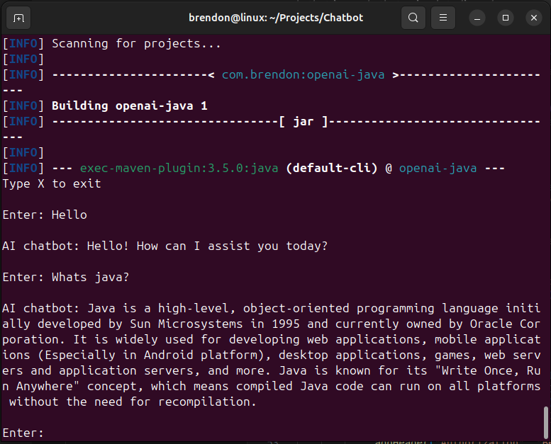

# AI Chatbot - Brendon So

# Intro
Welcome to my Chatbot project! This is a simple Java chatbot that allows users to communicate with OpenAI's gpt-4.

**Example**



# Features
- **OpenAi**: This project uses the OkHttp client to manage HTTP request & responses from OpenAI.

# Installation
**Clone or download**
```bash
git clone https://github.com/brendonso/AI-Chatbot.git
```

**note**

*Replace API_KEY string with a valid key*

**To run this program it requires maven** 
```bash
sudo apt install maven -y
```
**Compile in the projects folder**
```bash
mvn compile
```
**Run**
```bash
mvn exec:java -Dexec.mainClass="Chatbot"
```
